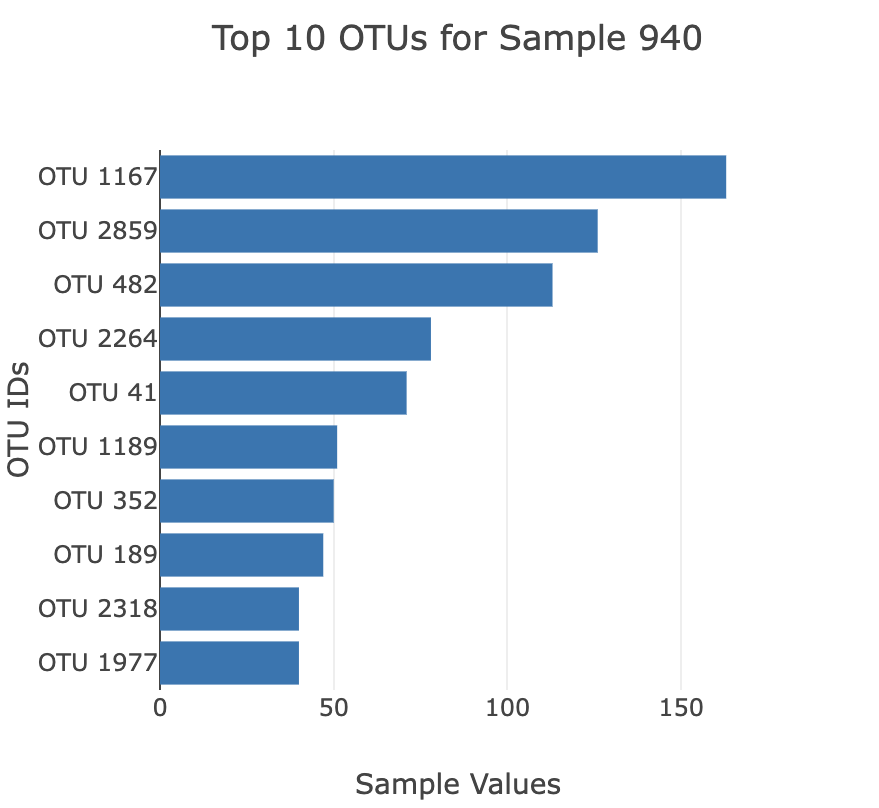
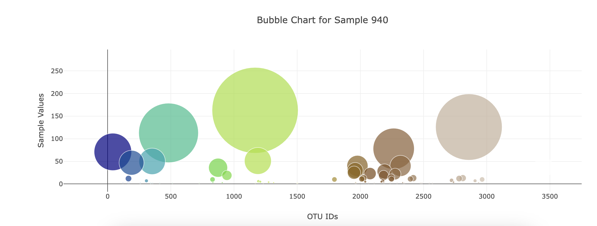
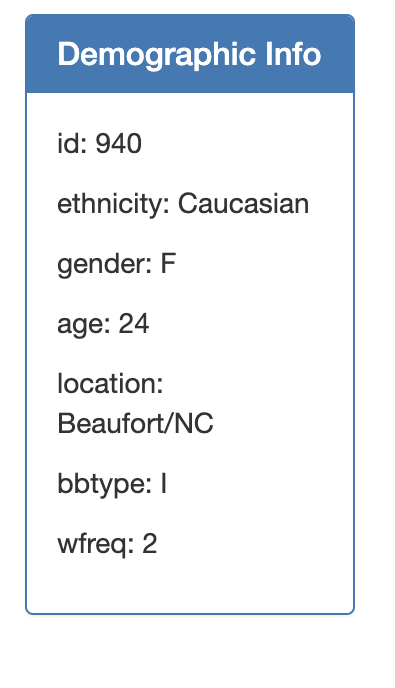

# Module 14: Belly Button Challenge

## Table of Contents
- [About](#about)
- [Tools](#tools)
- [Key Steps](#key-steps)
   - [JSON Data](#json-data)
   - [Horizontal Bar Chart](#horizontal-bar-chart)
   - [Metadata](#metadata)
 
## About
In this project I built an interactive dashboard to explore the Belly Button Biodiversity dataset, which catalogs the microbes that colonize human navels.

## Tools
- Javascript
- D3
- HTML
- Plotly

## Key Steps
#### **JSON Data**
Used D3 to read in sample JSON data from a sample [url](https://2u-data-curriculum-team.s3.amazonaws.com/dataviz-classroom/v1.1/14-Interactive-Web-Visualizations/02-Homework/samples.json).

--------------------------------------------------- 
#### **Horizontal Bar Chart**
Created a horizontal bar chart with a dropdown menu to display the top 10 microbial species (also called operational taxonomic units, or OTUs) found in each sample individual.

--------------------------------------------------- 
#### **Bubble Chart**
Created a bubble chart that displayed the OTU values for each selected individual wtih a marker for bubble size and an OTU label on hover.

--------------------------------------------------- 
#### **Metadata**
Showed demographic data for each selected individual, displayed as key:value pairs.

--------------------------------------------------- 

